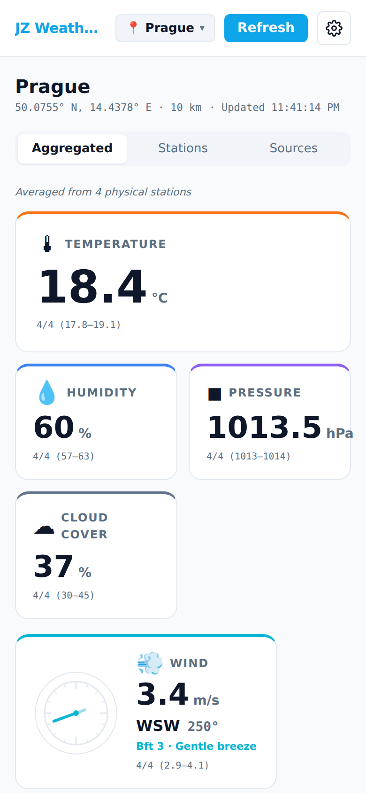
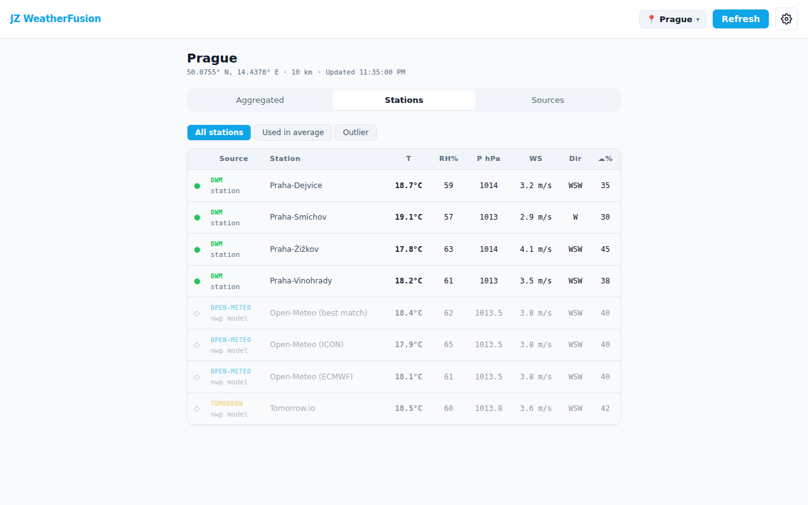
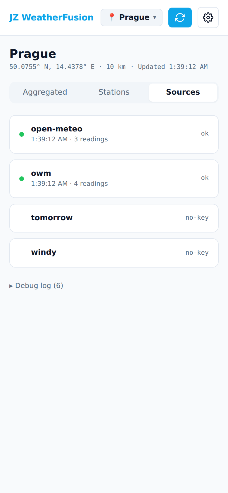
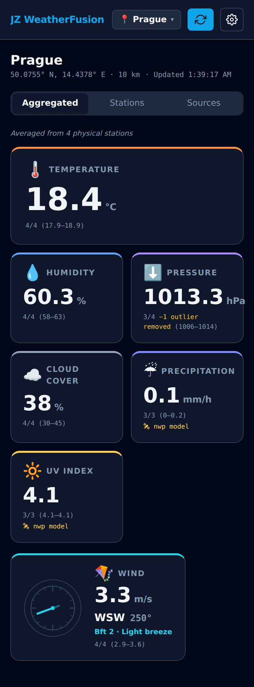
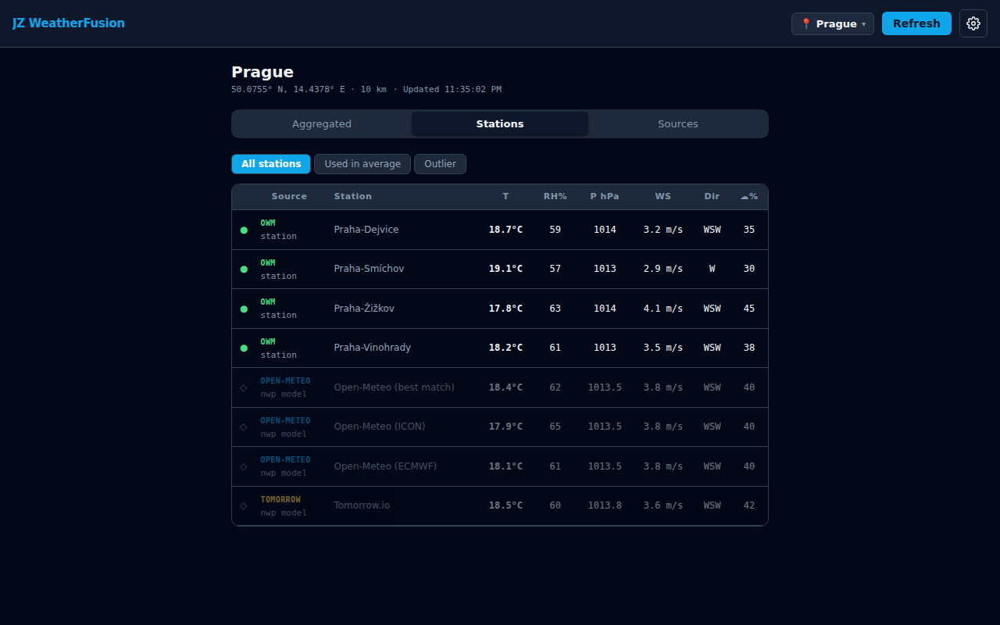
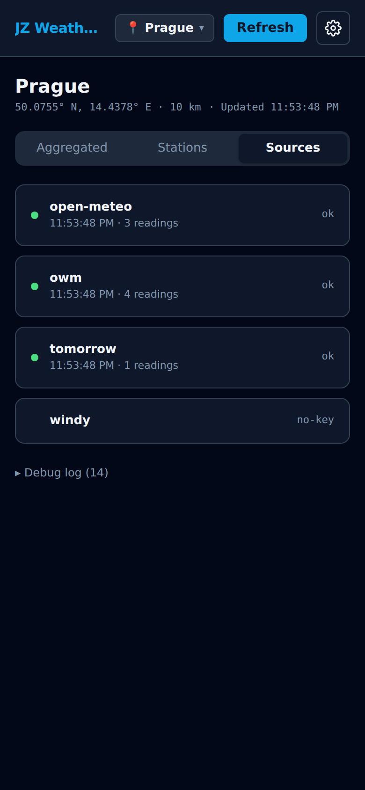

# JZ WeatherFusion

🇬🇧 [English](#english) · 🇨🇿 [Česky](#česky)

---

## English

Personal weather station aggregator. Collects readings from physical stations and NWP models, filters outliers, and displays a fused average in a clean interface. Client-only React PWA — all config (API keys, locations) stays in your browser's `localStorage` and is sent only to the respective weather APIs.

**Live app:** https://honzabfu.github.io/jz-weatherfusion/

### Screenshots

| Aggregated | Stations | Sources |
|:---:|:---:|:---:|
|  |  |  |
|  |  |  |

### Quick start

1. Open the app at the link above.
2. Click **Add location** (or the + icon) and search by place name, or enter coordinates manually.
3. The app immediately fetches data from all configured sources.

### Tabs

| Tab | Description |
|-----|-------------|
| **Average** | Fused values — physical stations are preferred; NWP models are used as fallback when no stations are available. Shows how many sources contributed to the average. |
| **Stations** | Individual station breakdown — what was used, what was excluded and why. |
| **Sources** | Status of each data source, error messages, and last fetch time. |

### Data sources

Sources fall into two categories:

- **Physical stations** — on-site sensor readings; most accurate for local conditions.
- **NWP models** — numerical weather prediction on a grid; values represent a large area, not a specific point.

| Source | Type | API key | Description |
|--------|------|---------|-------------|
| **Open-Meteo** | NWP model | not required | 3 models (best\_match, ICON, ECMWF); includes UV index |
| **OpenWeatherMap** | Physical stations | required (free) | Citizen weather stations (PWS) within a configurable radius |
| **Tomorrow.io** | NWP model | required (free) | Hybrid model (NWP + satellite + radar) |
| **Windy** | NWP model | required (free) | GFS 0.25° model; data tagged as approximate (≈) and always excluded from the average |

#### Where to get API keys

- **OpenWeatherMap** — https://openweathermap.org/api (free tier: 60 req/min)
- **Tomorrow.io** — https://www.tomorrow.io (free plan available — see tomorrow.io for current limits)
- **Windy** — https://api.windy.com/point-forecast (free tier: testing only, data deliberately shuffled/modified — 500 req/day)

Keys are entered in **Settings → API Keys** and stored exclusively in your browser's `localStorage` — they are never sent anywhere else.

### Settings

Open settings with the gear icon in the top right.

| Option | Description |
|--------|-------------|
| **Language** | English / Czech / Spanish |
| **Theme** | Light / Dark / System |
| **Font size** | Small / Medium / Large |
| **Units** | Metric (°C, hPa, m/s, mm) or Imperial (°F, inHg, mph, in) |
| **Wind display** | m/s, km/h, mph, Beaufort scale, or combined |
| **IQR factor** | Outlier filtering strictness (1.0 = strict, 3.0 = lenient) |
| **Auto-refresh** | Auto-refresh every 5 / 15 / 30 min or disabled |
| **API Keys** | Keys for OpenWeatherMap, Tomorrow.io and Windy |
| **Export / Import** | Back up and restore the full config as JSON |

### How filtering and aggregation works

Aggregation happens in two steps:

**1. Source type selection**

Physical stations (OpenWeatherMap) measure actual on-site conditions, while NWP models work on a 1–28 km grid and interpolate values. Humidity and temperature can systematically differ by 10–20 %, with physical stations being more accurate for local conditions.

- If physical stations are available, the average is computed **exclusively from them**.
- If no physical stations are configured (no OWM key, or none within the search radius), NWP models are used as fallback.

**2. IQR outlier filter**

Within the selected sources, an IQR (interquartile range) filter is applied — stations with a significantly different value are flagged as outliers and excluded from the average. The arithmetic mean of the remaining values is computed (circular mean for wind direction).

The IQR factor can be adjusted in settings — lower is stricter, higher is more lenient.

**Indicators in the Stations tab**

| Symbol | Meaning |
|--------|---------|
| ● | Included in average |
| ○ | Excluded as outlier (IQR) |
| ◇ | NWP model excluded — physical stations take priority |
| ≈ | Approximate (Windy free tier) — always excluded |

### PWA — installation

The app is fully functional as a Progressive Web App. Click **Install app** (Chrome/Edge) or **Add to Home Screen** (Safari/iOS) and JZ WeatherFusion will run as a standalone app, including offline (shows last fetched data).

### Local development

```bash
npm install
npm run dev        # dev server at http://localhost:5173/jz-weatherfusion/
npm run build      # output to dist/
npm run preview    # preview production build
```

Deployment is automated via GitHub Actions — every push to `main` builds and publishes `dist/` to GitHub Pages.

---

## Česky

Agregátor dat z více meteorologických zdrojů. Aplikace sbírá měření ze stanic i numerických modelů, filtruje odlehlé hodnoty a zobrazuje jejich průměr v přehledném rozhraní. Čistě klientská React PWA — veškerá konfigurace (API klíče, lokality) zůstává v `localStorage` vašeho prohlížeče a odesílá se pouze na příslušná API.

**Živá aplikace:** https://honzabfu.github.io/jz-weatherfusion/

### Screenshoty

| Aggregated | Stations | Sources |
|:---:|:---:|:---:|
|  |  |  |
|  |  | |

### Rychlý start

1. Otevřete aplikaci na adrese výše.
2. Klikněte na **Add location** (nebo ikonu +) a vyhledejte místo jménem, nebo zadejte zeměpisné souřadnice.
3. Aplikace okamžitě načte data ze všech nakonfigurovaných zdrojů.

### Záložky

| Záložka | Popis |
|---------|-------|
| **Average** | Průměrné hodnoty — preferuje fyzické stanice; při jejich absenci použije NWP modely jako zálohu. Zobrazuje, z kolika zdrojů průměr pochází. |
| **Stations** | Přehled jednotlivých stanic — co bylo použito, co bylo vyloučeno a proč. |
| **Sources** | Stav jednotlivých datových zdrojů, chybové hlášky, čas posledního načtení. |

### Datové zdroje

Zdroje jsou rozděleny do dvou kategorií:

- **Fyzické stanice** — měří přímo na místě senzorem; nejpřesnější pro lokální podmínky.
- **NWP modely** — numerická předpověď počasí na mřížce; hodnoty reprezentují velkou plochu, nikoli konkrétní bod.

| Zdroj | Typ | API klíč | Popis |
|-------|-----|----------|-------|
| **Open-Meteo** | NWP model | nevyžadován | 3 modely (best\_match, ICON, ECMWF); poskytuje i UV index |
| **OpenWeatherMap** | Fyzické stanice | vyžadován (zdarma) | Občanské měřicí stanice (PWS) v okolí zadané polohy |
| **Tomorrow.io** | NWP model | vyžadován (zdarma) | Hybridní model (NWP + satelit + radar) |
| **Windy** | NWP model | vyžadován (zdarma) | GFS model 0,25°; data označena jako přibližná (≈) a z agregace vždy vyloučena |

#### Kde získat API klíče

- **OpenWeatherMap** — https://openweathermap.org/api (volný tarif: 60 dotazů/min)
- **Tomorrow.io** — https://www.tomorrow.io (volný plán k dispozici — aktuální limity viz tomorrow.io)
- **Windy** — https://api.windy.com/point-forecast (volný tarif: pouze pro testování, data záměrně pozměněna — 500 dotazů/den)

Klíče se zadávají v **Nastavení → API Keys** a ukládají se výhradně do `localStorage` vašeho prohlížeče — nikam se neodesílají.

### Nastavení

Nastavení otevřete ikonou ozubeného kola vpravo nahoře.

| Možnost | Popis |
|---------|-------|
| **Language** | Angličtina / Čeština / Španělština |
| **Theme** | Světlý / Tmavý / Systémový |
| **Font size** | Malé / Střední / Velké |
| **Units** | Metrické (°C, hPa, m/s, mm) nebo imperiální (°F, inHg, mph, in) |
| **Wind display** | m/s, km/h, mph, Beaufortova stupnice nebo kombinace |
| **IQR factor** | Přísnost filtrace odlehlých hodnot (1,0 = přísné, 3,0 = volné) |
| **Auto-refresh** | Automatické obnovení každých 5 / 15 / 30 min nebo vypnuto |
| **API Keys** | Klíče pro OpenWeatherMap, Tomorrow.io a Windy |
| **Export / Import** | Záloha a obnova celé konfigurace jako JSON |

### Jak funguje filtrování a agregace

Agregace probíhá ve dvou krocích:

**1. Výběr zdroje dat**

Fyzické stanice (OpenWeatherMap) měří skutečné podmínky přímo na místě, zatímco NWP modely pracují s mřížkou o rozlišení 1–28 km a hodnoty interpolují. Vlhkost nebo teplota se mezi nimi mohou systematicky lišit o 10–20 %, přičemž fyzické stanice jsou pro lokální podmínky přesnější.

- Pokud jsou k dispozici fyzické stanice, průměr se počítá **výhradně z nich**.
- Nejsou-li fyzické stanice nakonfigurovány (žádný OWM klíč nebo žádná stanice v daném okruhu), použijí se NWP modely jako záloha.

**2. IQR filtr odlehlých hodnot**

V rámci vybraných zdrojů se aplikuje IQR filtr (mezikvartilové rozpětí) — stanice s výrazně odlišnou hodnotou jsou označeny jako odlehlé a z průměru vyloučeny. Ze zbývajících hodnot se spočítá aritmetický průměr (pro směr větru kruhový průměr).

Faktor IQR lze upravit v nastavení — nižší hodnota je přísnější, vyšší tolerantnější.

**Indikátory v záložce Stations**

| Symbol | Význam |
|--------|--------|
| ● | Zahrnuto v průměru |
| ○ | Vyloučeno jako odlehlá hodnota (IQR) |
| ◇ | NWP model vyloučen — fyzické stanice mají přednost |
| ≈ | Přibližné (Windy bezplatný tarif) — vždy vyloučeno |

### PWA — instalace

Aplikace je plně funkční jako Progressive Web App. Klikněte na **Instalovat aplikaci** (Chrome/Edge) nebo **Přidat na plochu** (Safari/iOS) a JZ WeatherFusion bude fungovat jako samostatná aplikace i bez připojení (zobrazí naposledy načtená data).

### Lokální vývoj

```bash
npm install
npm run dev        # dev server na http://localhost:5173/jz-weatherfusion/
npm run build      # výstup do dist/
npm run preview    # náhled produkčního buildu
```

Nasazení probíhá automaticky přes GitHub Actions při každém pushnutí do větve `main` — build se publikuje na GitHub Pages.
